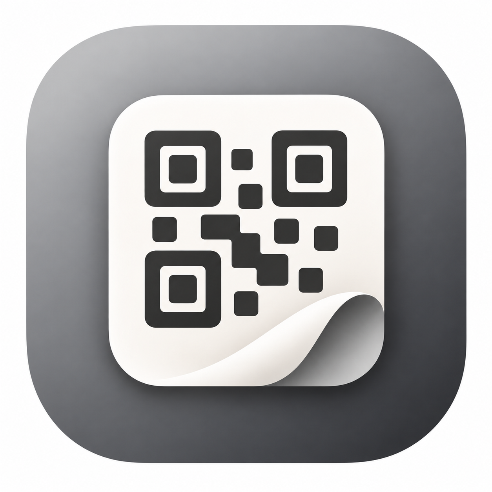

<p align="center"></p>

# Wallpad

Scan a QR code on an office TV and your phone becomes a remote for the Mac behind it.

**Setup** (needs a Cloudflare account and an Apple Development certificate):

```bash
cd worker && cp wrangler.example.toml wrangler.toml
npx wrangler kv namespace create TVS            # paste the id into wrangler.toml
mkdir -p ~/Library/Application\ Support/Wallpad
openssl rand -hex 32 > ~/Library/Application\ Support/Wallpad/admin-key
npx wrangler secret put ADMIN_KEY < ~/Library/Application\ Support/Wallpad/admin-key
npx wrangler deploy && cd ..                    # note the workers.dev URL
echo "https://wallpad.<you>.workers.dev" > .router
scripts/package.sh && (cd worker && npx wrangler deploy)
```

**Add a TV:** run `scripts/install-command.sh "Lobby TV"`, paste the copied command into Terminal on the TV's Mac,
allow Wallpad in Privacy & Security → Accessibility, then print the QR card from its Desktop and stick it on the TV.

MIT
